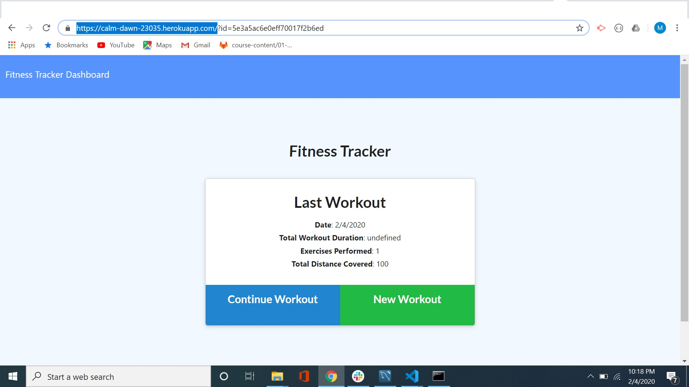

# workout-tracker
In this app you will be able to add exercises to your workout like reps and distanse with a graph of your progress.
you will need to do an npm install, it will aldo require to install mongodb

main page img: 
# Code Snips

// discriminator looks at type to know what type of excercise
var options = {
  discriminatorKey: "type",
  _id: false
};